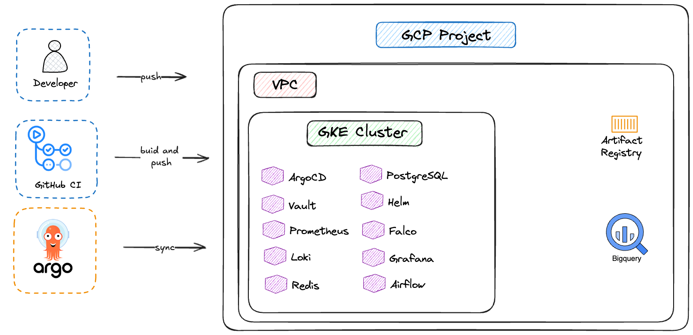

# Platform Engineering Lab — GKE

A hands-on, end-to-end platform engineering project built on Google Kubernetes Engine. Each phase solves a real problem faced by **CoverLine** — a fictional digital health insurer — as it grows from a 2-person startup to a 2,000,000-member enterprise.

Built as a portfolio project and study path toward **7 industry certifications**: Terraform Associate, GCP ACE, Prometheus Certified Associate, CKAD, CKA, GCP Professional Cloud DevOps Engineer, and CKS.

> **New here?** Start with [STORY.md](./STORY.md) — the narrative behind every technical decision, told through CoverLine's growing pains.


---


---

## Tech Stack


---

## Phases

Each phase is driven by a real engineering crisis at CoverLine. Click a phase to open its step-by-step guide.

| Phase | Topic | Problem that triggered it | Status |
|---|---|---|---|
| 0 | [Foundations — Docker, Linux, Git](./phase-0-foundations/README.md) | App only runs on one laptop — can't demo to investors | ✅ Complete |
| 1 | [Cloud & Terraform — GCP, VPC, GKE](./phase-1-terraform/README.md) | Infrastructure provisioned by hand — can't reproduce it | ✅ Complete |
| 2 | [Kubernetes Core — raw YAML](./phase-2-kubernetes/README.md) | One bad deploy takes down the entire platform | ✅ Complete |
| 3 | [Helm & Microservices — PostgreSQL, Redis](./phase-3-helm/README.md) | Teams block each other — everything ships as one unit | ✅ Complete |
| 3b | Event-Driven Architecture — Kafka, Strimzi | Sync calls between services cause cascading failures | ⬜ Not started |
| 4 | [CI/CD Pipelines](./phase-4-ci-cd/README.md) | Manual deploys take half a day, releases are delayed | ✅ Complete |
| 5 | [GitOps with ArgoCD](./phase-5-gitops/README.md) | Someone pushed to prod on a Friday and broke claims | ✅ Complete |
| 5b | [Progressive Delivery — Argo Rollouts](./phase-5b-progressive-delivery/README.md) | Bad releases reach 100% of users before anyone notices | ⬜ Not started |
| 6 | [Observability — Prometheus, Grafana, Loki](./phase-6-observability/README.md) · **PCA** | 4-hour outage — found out from a customer, not an alert | ✅ Complete |
| 7 | [Secrets Management — Vault](./phase-7-vault/README.md) | GDPR audit: DB credentials found in plaintext in Git | ✅ Complete |
| 8 | [Advanced Kubernetes](./phase-8-advanced-k8s/README.md) · **CKAD · CKA** | Open enrollment — 10× traffic spike, app down for 45 min | 🔄 In progress |
| 8b | Service Mesh — Istio, mTLS, tracing | Services trust each other blindly — no encryption in-cluster | ⬜ Not started |
| 9 | [Data Platform — Airflow, dbt, BigQuery](./phase-9-data-platform/README.md) · **GCP DevOps** | Actuarial team manually exporting CSVs every Monday | ⬜ Not started |
| 10 | Security & Production Hardening | ISO 27001 audit — pods running as root, no network policies | ⬜ Not started |
| 10b | CKS Exam Preparation · **CKS** | — | ⬜ Not started |
| 10c | Backup & Disaster Recovery — Velero, pg_dump | No tested restore procedure — one PVC loss = data gone | ⬜ Not started |
| 10d | Chaos Engineering — LitmusChaos | Reliability claims are untested — failures found in production | ⬜ Not started |
| 10e | FinOps & Cost Visibility — Kubecost | Cloud bill growing faster than the user base | ⬜ Not started |
| 11 | Capstone — full platform, Backstage IDP | Zero manual steps, multi-environment, self-service for devs | ⬜ Not started |
| 12 | GenAI & Agentic Workflows — Claude API, Airflow | Claims triage still done manually by the ops team | ⬜ Not started |

> See [roadmap.md](./roadmap.md) for time estimates, cost breakdowns, and certification milestones.

---

## Architecture



---

## Certification Path

| Certification | Issuer | Unlocked after |
|---|---|---|
| Terraform Associate (003) | HashiCorp | Phase 1 |
| Google Cloud Associate Cloud Engineer | Google | Phase 1 |
| Prometheus Certified Associate (PCA) | CNCF | Phase 6 |
| Certified Kubernetes Application Developer (CKAD) | CNCF | Phase 8 |
| Certified Kubernetes Administrator (CKA) | CNCF | Phase 8 |
| GCP Professional Cloud DevOps Engineer | Google | Phase 9 |
| Certified Kubernetes Security Specialist (CKS) | CNCF | Phase 10b |

---

## Getting Started

Phases 1 and above require a GCP account with billing enabled.

1. Sign in at [console.cloud.google.com](https://console.cloud.google.com) and activate the **$300 free trial** (card required but not charged unless you manually upgrade)
2. Install the [gcloud CLI](https://cloud.google.com/sdk/docs/install) and authenticate:

```bash
gcloud auth login
gcloud auth application-default login
```

3. Check prerequisites (full list with versions in [roadmap.md](./roadmap.md#prerequisites)):

```bash
docker --version && terraform --version && kubectl version --client && helm version
```

> **Cost:** A running GKE cluster costs ~$5–20/day. Always run `terraform destroy` when done with a session.

---

## ADRs

11 Architecture Decision Records in [`docs/decisions/`](./docs/decisions/) document every major tool choice — from why GKE over self-managed Kubernetes to why Vault runs on a dedicated VM instead of inside the cluster.
