# Phase 11 — Capstone: The Platform You Wish You'd Had From Day One

---

> **CoverLine — 2,000,000+ covered members. Series C.**
>
> A new CTO joined from a large-scale platform background and ran a full infrastructure review. The verdict was clear:
>
> The platform works. But it was assembled phase by phase under pressure, and it shows. There is no single place to see the health of the entire system. Onboarding a new engineer still takes three days of Slack messages, tribal knowledge, and manual kubectl commands. Deploying to a new country requires manually duplicating Terraform and hoping you remember every environment-specific variable. Some services still have hardcoded config that nobody dares touch because no one fully understands what it feeds.
>
> The security team fixed the worst gaps in Phase 10. The observability stack landed in Phase 6. The CI/CD pipeline matured through Phases 4 and 5. ArgoCD is syncing. Vault is running. Progressive delivery is wired up.
>
> But the pieces do not talk to each other as a platform. They are components, not a system.
>
> The CTO's mandate, written in a shared doc and left open for the whole engineering org to read: *"Build the platform you wish you'd had from day one. Zero manual steps from code to production. Multi-environment. Fully observable. Secure by default. Every service self-documented and discoverable. Done."*

---

## What we'll build

| Component | What it does |
|-----------|-------------|
| **Multi-environment Terraform** | `dev` / `staging` / `prod` as separate environment directories sharing common modules — isolated state per environment in GCS |
| **ArgoCD ApplicationSets** | One manifest that automatically creates one ArgoCD Application per service per environment from Git |
| **Full GitOps promotion pipeline** | Feature branch → CI (build + Trivy scan) → dev auto-deploy → staging manual gate → prod with second approver |
| **Backstage IDP** | Internal Developer Portal — service catalog, self-service scaffolding, and TechDocs pulled from this repo |
| **Unified Grafana dashboard** | All services in one view: RED metrics per service, node utilisation, SLO burn rate panel |
| **Security baseline as code** | RBAC, NetworkPolicies, and Pod Security Standards wired into the ApplicationSet so every new environment inherits them automatically |

---

## Prerequisites

Phases 1 through 10 must be complete. The capstone layer sits on top of everything built so far — it does not replace any of it.

Start with a clean dev cluster before running the capstone bootstrap:

```bash
cd phase-1-terraform/envs/dev
terraform init && terraform apply -var-file=dev.tfvars
gcloud container clusters get-credentials platform-eng-lab-will-dev-gke \
  --region us-central1 --project platform-eng-lab-will
cd ../../.. && bash bootstrap.sh --phase 11
```

Verify everything is running before proceeding:

```bash
kubectl get pods
kubectl get pods -n argocd
kubectl get pods -n monitoring
```

Local tools required:

```bash
brew install terraform helm argocd trivy
npm install -g @backstage/create-app
```

---

## Step 1 — Multi-Environment Terraform

### The problem

The Terraform in `phase-1-terraform` was written for a single cluster. Adding staging and prod by copying the directory and changing values by hand creates drift — a variable update in one environment is easy to miss in the others. State files living locally means no audit trail of who changed infrastructure and when.

### Approach: environment directories with shared modules and GCS remote state

Rather than Terraform workspaces (which share the same root module with a workspace-scoped state), we use **separate directories per environment** under `phase-1-terraform/envs/`. Each directory has its own `backend.tf` pointing to a shared GCS bucket with a different prefix, its own `*.tfvars`, and calls the same shared modules in `phase-1-terraform/modules/`.

This gives stronger isolation — a `terraform apply` in `envs/dev/` cannot accidentally affect staging state — and makes it easy to diff environments by comparing their var files.

**Directory structure:**

```
phase-1-terraform/
├── modules/
│   ├── gke/
│   ├── networking/
│   └── bigquery/
└── envs/
    ├── dev/
    │   ├── backend.tf        # GCS state: bucket=platform-eng-lab-will-tfstate, prefix=dev/terraform/state
    │   ├── providers.tf
    │   ├── main.tf           # Module calls with naming_prefix = project_id-environment
    │   ├── variables.tf
    │   └── dev.tfvars
    ├── staging/
    │   ├── backend.tf        # prefix=staging/terraform/state
    │   └── staging.tfvars
    └── prod/
        ├── backend.tf        # prefix=prod/terraform/state
        └── prod.tfvars
```

Create the shared state bucket (one-time):

```bash
gsutil mb -p platform-eng-lab-will -l us-central1 gs://platform-eng-lab-will-tfstate
gsutil versioning set on gs://platform-eng-lab-will-tfstate
```

Each environment's `backend.tf` points at a separate prefix in the same bucket:

```hcl
terraform {
  backend "gcs" {
    bucket = "platform-eng-lab-will-tfstate"
    prefix = "dev/terraform/state"   # staging/ or prod/ for other environments
  }
}
```

Each environment's `main.tf` calls the shared modules with a naming prefix that includes the environment, so all resources are namespaced:

```hcl
locals {
  naming_prefix = "${var.project_id}-${var.environment}"
}

module "networking" {
  source          = "../../modules/networking"
  vpc_name        = "${local.naming_prefix}-vpc"
  subnetwork_name = "${local.naming_prefix}-subnet"
  subnetwork_cidr = var.subnetwork_cidr
  # ...
}

module "gke" {
  source       = "../../modules/gke"
  cluster_name = "${local.naming_prefix}-gke"
  environment  = var.environment
  # ...
}
```

The var files set environment-specific sizes. Dev is minimal; staging and prod scale up:

| Variable | dev | staging | prod |
|---|---|---|---|
| `machine_type` | `e2-medium` | `e2-standard-2` | `e2-medium` |
| `min_node_count` | 1 | 1 | 1 |
| `max_node_count` | 1 | 2 | 2 |
| `subnetwork_cidr` | `10.10.0.0/16` | `10.40.0.0/16` | `10.70.0.0/16` |

Non-overlapping CIDRs are important if you ever peer the VPCs or run a shared VPN.

Provision each environment independently:

```bash
# Dev
cd phase-1-terraform/envs/dev
terraform init
terraform apply -var-file=dev.tfvars

# Staging
cd ../staging
terraform init
terraform apply -var-file=staging.tfvars

# Prod
cd ../prod
terraform init
terraform apply -var-file=prod.tfvars
```

Verify all three clusters exist:

```bash
gcloud container clusters list --project=platform-eng-lab-will
```

Expected output:

```
NAME                                   LOCATION     STATUS
platform-eng-lab-will-dev-gke          us-central1  RUNNING
platform-eng-lab-will-stag-gke         us-central1  RUNNING
platform-eng-lab-will-prod-gke         us-central1  RUNNING
```

Fetch credentials for all three:

```bash
for env in dev stag prod; do
  gcloud container clusters get-credentials "platform-eng-lab-will-${env}-gke" \
    --region us-central1 \
    --project platform-eng-lab-will
done
```

Verify the kubectl contexts:

```bash
kubectl config get-contexts | grep platform-eng-lab-will
```

---

## Step 2 — ArgoCD ApplicationSets

### The problem

With three environments and multiple services, the ArgoCD Application manifest approach from Phase 5 no longer scales. Adding a new service means writing four new Application manifests — one per environment plus one for the top-level app-of-apps. Adding a new environment means touching every service. This is the exact kind of manual overhead the capstone exists to eliminate.

**Phase 5 approach — does not scale:**

```mermaid
flowchart LR
    subgraph Manifests["Git: ArgoCD Application manifests (Phase 5)"]
        M1["app-backend-dev.yaml"]
        M2["app-frontend-dev.yaml"]
        M3["app-backend-staging.yaml"]
        M4["app-frontend-staging.yaml"]
        M5["app-backend-prod.yaml"]
        M6["app-frontend-prod.yaml"]
        M7["app-of-apps.yaml"]
    end

    subgraph Problem["Add a new service (e.g. claims-api)"]
        N1["app-claims-api-dev.yaml ✏️"]
        N2["app-claims-api-staging.yaml ✏️"]
        N3["app-claims-api-prod.yaml ✏️"]
        N4["app-of-apps.yaml ✏️  (update)"]
    end

    Manifests --> Problem
    style Problem fill:#fee2e2,stroke:#ef4444
```

**Phase 11 approach — one manifest, any number of services or environments:**

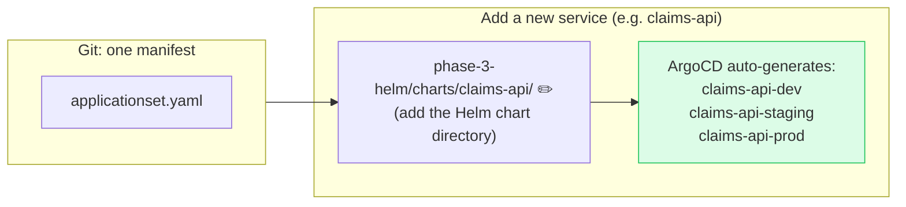

### Replace per-service Applications with a single ApplicationSet

An ApplicationSet uses a generator to produce one ArgoCD Application per combination of cluster and service. The Git generator reads a directory structure. The cluster generator reads ArgoCD's registered clusters. We will use the Matrix generator to combine both.

First, register each cluster with ArgoCD. Run these commands against the cluster where ArgoCD is installed (dev):

```bash
kubectl config use-context gke_platform-eng-lab-will_us-central1_platform-eng-lab-will-gke-dev

argocd login \
  --insecure \
  --grpc-web \
  localhost:8080 \
  --username admin \
  --password "$(kubectl -n argocd get secret argocd-initial-admin-secret \
      -o jsonpath='{.data.password}' | base64 -d)"

argocd cluster add \
  gke_platform-eng-lab-will_us-central1_platform-eng-lab-will-gke-staging \
  --name staging

argocd cluster add \
  gke_platform-eng-lab-will_us-central1_platform-eng-lab-will-gke-prod \
  --name prod
```

Verify the clusters are registered:

```bash
argocd cluster list
```

Expected:

```
SERVER                                                       NAME      STATUS
https://kubernetes.default.svc                               in-cluster  Successful
https://<staging-api-endpoint>                               staging     Successful
https://<prod-api-endpoint>                                  prod        Successful
```

Now create the ApplicationSet. Save this to `phase-11-capstone/argocd/applicationset.yaml`:

```yaml
apiVersion: argoproj.io/v1alpha1
kind: ApplicationSet
metadata:
  name: coverline-platform
  namespace: argocd
spec:
  generators:
    - matrix:
        generators:
          # Generator 1: one entry per registered cluster
          - clusters:
              selector:
                matchLabels:
                  argocd.argoproj.io/secret-type: cluster
              values:
                env: "{{name}}"  # 'staging' or 'prod' — or 'in-cluster' for dev
          # Generator 2: one entry per service directory in the Helm charts path
          - git:
              repoURL: https://github.com/wb-platform-engineering-lab/platform-engineering-lab-gke.git
              revision: HEAD
              directories:
                - path: phase-3-helm/charts/*
  template:
    metadata:
      name: "coverline-{{path.basename}}-{{values.env}}"
      labels:
        environment: "{{values.env}}"
        service: "{{path.basename}}"
    spec:
      project: default
      source:
        repoURL: https://github.com/wb-platform-engineering-lab/platform-engineering-lab-gke.git
        targetRevision: HEAD
        path: "{{path}}"
        helm:
          valueFiles:
            - values.yaml
            - "values-{{values.env}}.yaml"
      destination:
        server: "{{server}}"
        namespace: coverline
      syncPolicy:
        automated:
          prune: true
          selfHeal: true
        syncOptions:
          - CreateNamespace=true
```

Apply the ApplicationSet to ArgoCD:

```bash
kubectl apply -f phase-11-capstone/argocd/applicationset.yaml -n argocd
```

Watch the Applications being generated:

```bash
kubectl get applications -n argocd -w
```

Within two minutes you should see ArgoCD create one Application per service per environment. For example:

```
NAME                              SYNC STATUS   HEALTH STATUS
coverline-backend-staging         Synced        Healthy
coverline-backend-prod            Synced        Healthy
coverline-frontend-staging        Synced        Healthy
coverline-frontend-prod           Synced        Healthy
```

### How the Matrix generator works

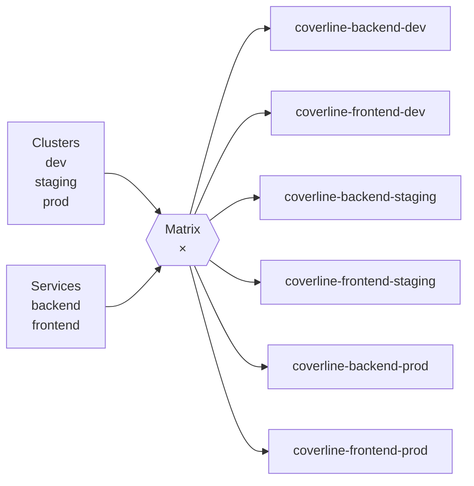

Each Application resolves Helm values in two layers:
1. `values.yaml` — base config (image, port, replica defaults)
2. `values-{{env}}.yaml` — environment override (replica count, resource limits, image tag)

Any push to `main` that changes a chart or values file triggers ArgoCD's automated sync to the matching cluster — no manual `helm upgrade` needed.

### Per-environment Helm values

For the ApplicationSet `values-{{values.env}}.yaml` override to work, each chart needs an environment-specific values file alongside `values.yaml`. For example, `phase-3-helm/charts/backend/values-prod.yaml`:

```yaml
replicaCount: 3

resources:
  requests:
    cpu: "250m"
    memory: "256Mi"
  limits:
    cpu: "500m"
    memory: "512Mi"

image:
  tag: ""  # Will be overridden by the CI/CD pipeline with the exact image SHA
```

And `phase-3-helm/charts/backend/values-staging.yaml`:

```yaml
replicaCount: 2

resources:
  requests:
    cpu: "100m"
    memory: "128Mi"
  limits:
    cpu: "250m"
    memory: "256Mi"

image:
  tag: ""
```

---

## Step 3 — Full Promotion Pipeline (dev → staging → prod)

### Pipeline architecture

**Phase 4 approach — manual deploys, no promotion gates:**

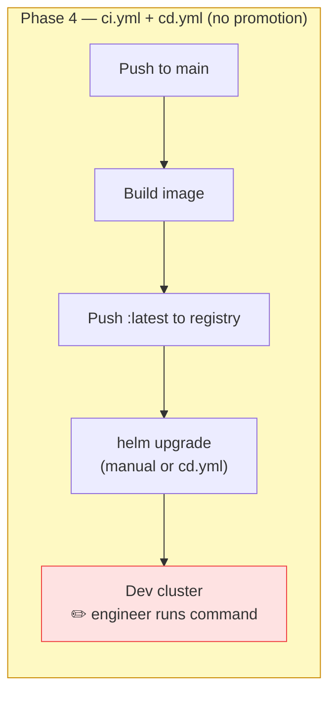

**Phase 11 approach — scan-gated CI, GitOps promotion with approval gates:**

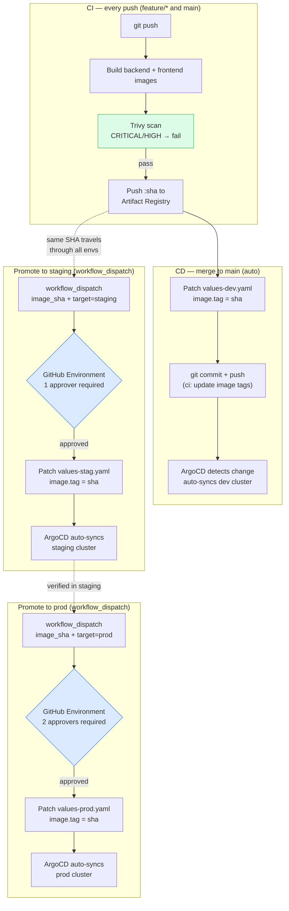

| Stage | Trigger | Gate | GitOps mechanism |
|---|---|---|---|
| CI | Every push | Trivy scan must pass | Image only pushed if clean |
| Dev deploy | Merge to `main` | None (automatic) | `cd.yml` patches `values-dev.yaml` → ArgoCD syncs |
| Staging promotion | `workflow_dispatch` | 1 approver | `platform-pipeline.yml` patches `values-stag.yaml` → ArgoCD syncs |
| Prod promotion | `workflow_dispatch` | 2 approvers | `platform-pipeline.yml` patches `values-prod.yaml` → ArgoCD syncs |

### GitHub Actions workflow

Save this to `.github/workflows/platform-pipeline.yml`:

```yaml
name: Platform Pipeline

on:
  push:
    branches:
      - main
      - "feature/**"
  workflow_dispatch:
    inputs:
      image_sha:
        description: "Image SHA to promote (e.g. abc1234)"
        required: true
      target_env:
        description: "Target environment: staging or prod"
        required: true
        type: choice
        options:
          - staging
          - prod

env:
  REGISTRY: us-central1-docker.pkg.dev/platform-eng-lab-will/coverline
  PROJECT: platform-eng-lab-will
  REGION: us-central1

jobs:
  # ── CI: runs on every push to any branch ─────────────────────────────────
  ci:
    name: Build and Scan
    runs-on: ubuntu-latest
    permissions:
      contents: read
      id-token: write
    outputs:
      image_sha: ${{ steps.meta.outputs.sha }}

    steps:
      - uses: actions/checkout@v4

      - name: Authenticate to GCP
        uses: google-github-actions/auth@v2
        with:
          workload_identity_provider: ${{ secrets.WIF_PROVIDER }}
          service_account: ${{ secrets.WIF_SERVICE_ACCOUNT }}

      - name: Configure Docker for Artifact Registry
        run: gcloud auth configure-docker us-central1-docker.pkg.dev --quiet

      - name: Set image SHA output
        id: meta
        run: echo "sha=${GITHUB_SHA::7}" >> "$GITHUB_OUTPUT"

      - name: Build backend image
        run: |
          docker build \
            -t ${{ env.REGISTRY }}/backend:${{ steps.meta.outputs.sha }} \
            phase-3-helm/app/backend/

      - name: Scan backend image for CVEs
        run: |
          curl -sfL https://raw.githubusercontent.com/aquasecurity/trivy/main/contrib/install.sh \
            | sh -s -- -b /usr/local/bin
          trivy image \
            --severity CRITICAL,HIGH \
            --exit-code 1 \
            --ignore-unfixed \
            ${{ env.REGISTRY }}/backend:${{ steps.meta.outputs.sha }}

      - name: Build frontend image
        run: |
          docker build \
            -t ${{ env.REGISTRY }}/frontend:${{ steps.meta.outputs.sha }} \
            phase-3-helm/app/frontend/

      - name: Scan frontend image for CVEs
        run: |
          trivy image \
            --severity CRITICAL,HIGH \
            --exit-code 1 \
            --ignore-unfixed \
            ${{ env.REGISTRY }}/frontend:${{ steps.meta.outputs.sha }}

      - name: Push images (main branch only)
        if: github.ref == 'refs/heads/main'
        run: |
          docker push ${{ env.REGISTRY }}/backend:${{ steps.meta.outputs.sha }}
          docker push ${{ env.REGISTRY }}/frontend:${{ steps.meta.outputs.sha }}

  # ── CD: auto-deploys to dev on every merge to main ───────────────────────
  deploy-dev:
    name: Deploy to dev
    needs: ci
    runs-on: ubuntu-latest
    if: github.ref == 'refs/heads/main'
    permissions:
      contents: write
      id-token: write

    steps:
      - uses: actions/checkout@v4
        with:
          token: ${{ secrets.GITHUB_TOKEN }}

      - name: Update dev image tag
        run: |
          SHA=${{ needs.ci.outputs.image_sha }}
          # Patch the image tag in each chart's dev values file
          for chart in backend frontend; do
            VALUES="phase-3-helm/charts/${chart}/values-dev.yaml"
            # Use yq to update the tag field
            yq eval ".image.tag = \"${SHA}\"" -i "$VALUES"
          done

      - name: Commit and push values change
        run: |
          git config user.name  "github-actions[bot]"
          git config user.email "github-actions[bot]@users.noreply.github.com"
          git add phase-3-helm/charts/*/values-dev.yaml
          git commit -m "chore(dev): deploy image sha ${{ needs.ci.outputs.image_sha }}"
          git push

  # ── Manual promotion: staging or prod ────────────────────────────────────
  promote:
    name: Promote to ${{ github.event.inputs.target_env }}
    runs-on: ubuntu-latest
    if: github.event_name == 'workflow_dispatch'
    environment: ${{ github.event.inputs.target_env }}  # triggers protection rules
    permissions:
      contents: write
      id-token: write

    steps:
      - uses: actions/checkout@v4
        with:
          token: ${{ secrets.GITHUB_TOKEN }}

      - name: Update ${{ github.event.inputs.target_env }} image tag
        run: |
          SHA=${{ github.event.inputs.image_sha }}
          ENV=${{ github.event.inputs.target_env }}
          for chart in backend frontend; do
            VALUES="phase-3-helm/charts/${chart}/values-${ENV}.yaml"
            yq eval ".image.tag = \"${SHA}\"" -i "$VALUES"
          done

      - name: Commit and push values change
        run: |
          git config user.name  "github-actions[bot]"
          git config user.email "github-actions[bot]@users.noreply.github.com"
          ENV=${{ github.event.inputs.target_env }}
          git add phase-3-helm/charts/*/values-${ENV}.yaml
          git commit -m "chore(${ENV}): promote image sha ${{ github.event.inputs.image_sha }}"
          git push
```

### GitHub environment protection rules

Set up approval requirements in the GitHub repository settings. These rules gate the `promote` job before it runs.

Navigate to **Settings → Environments** in the GitHub repository.

For the `staging` environment:
- Required reviewers: 1 (e.g. a tech lead)
- Deployment branches: `main` only
- Wait timer: none

For the `prod` environment:
- Required reviewers: 2 (e.g. tech lead + CTO or SRE lead)
- Deployment branches: `main` only
- Wait timer: optional 5-minute delay to allow cancellation

With these rules, the `promote` job pauses at the `environment: prod` line and GitHub sends review requests to the configured approvers. The job does not continue until both have approved in the GitHub UI.

To trigger a promotion after a successful dev deploy:

```bash
# Get the SHA from the last dev deploy commit
SHA=$(git log --oneline | grep "chore(dev)" | head -1 | grep -oP '(?<=sha )\w+')
echo "Promoting SHA: $SHA"

# Trigger the workflow — GitHub will request approvals from configured reviewers
gh workflow run platform-pipeline.yml \
  -f image_sha="$SHA" \
  -f target_env=staging
```

---

## Step 4 — Install Backstage

### Why an internal developer portal

At 200 engineers across three time zones, the cost of tribal knowledge is measurable. A new engineer joining CoverLine's platform team needs to know: which team owns which service, where the runbook is, what the current SLO is, how to scaffold a new service without copy-pasting a template from Slack. Backstage provides all of this in one place, pulled directly from Git — so it is always current.

### Install Backstage via Helm

Add the Backstage Helm repository:

```bash
helm repo add backstage https://backstage.github.io/charts
helm repo update
```

Create a namespace and a values file:

```bash
kubectl create namespace backstage
```

Save the following to `phase-11-capstone/backstage/values.yaml`:

```yaml
backstage:
  image:
    registry: ghcr.io
    repository: backstage/backstage
    tag: latest

  appConfig:
    app:
      title: CoverLine Developer Portal
      baseUrl: http://localhost:7007

    backend:
      baseUrl: http://localhost:7007
      listen:
        port: 7007

    integrations:
      github:
        - host: github.com
          token: ${GITHUB_TOKEN}

    catalog:
      providers:
        github:
          coverlineOrg:
            organization: wb-platform-engineering-lab
            catalogPath: /catalog-info.yaml
            filters:
              branch: main
            schedule:
              frequency: { minutes: 30 }
              timeout: { minutes: 3 }

      rules:
        - allow: [Component, System, API, Resource, Location]

    techdocs:
      builder: external
      generator:
        runIn: local
      publisher:
        type: googleGcs
        googleGcs:
          bucketName: platform-eng-lab-will-techdocs

postgresql:
  enabled: true
  auth:
    password: backstage-local-dev-only

ingress:
  enabled: false
```

Install Backstage:

```bash
helm install backstage backstage/backstage \
  --namespace backstage \
  --values phase-11-capstone/backstage/values.yaml \
  --set backstage.extraEnvVars[0].name=GITHUB_TOKEN \
  --set backstage.extraEnvVars[0].value="$(vault kv get -field=github_token secret/coverline/backstage)"
```

Access the Backstage UI:

```bash
kubectl port-forward -n backstage svc/backstage 7007:7007
# Open http://localhost:7007
```

### catalog-info.yaml for the backend service

Add this file to the root of the repo as `catalog-info.yaml` and also save a copy to `phase-3-helm/app/backend/catalog-info.yaml`:

```yaml
apiVersion: backstage.io/v1alpha1
kind: Component
metadata:
  name: coverline-backend
  description: CoverLine claims processing API
  annotations:
    github.com/project-slug: wb-platform-engineering-lab/platform-engineering-lab-gke
    backstage.io/techdocs-ref: dir:.
    prometheus.io/alert: coverline-backend-error-rate
  tags:
    - python
    - flask
    - api
    - claims
  links:
    - url: https://github.com/wb-platform-engineering-lab/platform-engineering-lab-gke/blob/main/phase-3-helm/app/backend/
      title: Source Code
    - url: https://grafana.coverline.internal/d/platform-overview
      title: Grafana Dashboard
spec:
  type: service
  lifecycle: production
  owner: platform-team
  system: coverline-platform
  providesApis:
    - coverline-claims-api
  dependsOn:
    - resource:default/postgresql
    - resource:default/redis
```

`phase-3-helm/app/frontend/catalog-info.yaml`:

```yaml
apiVersion: backstage.io/v1alpha1
kind: Component
metadata:
  name: coverline-frontend
  description: CoverLine member-facing web application
  annotations:
    github.com/project-slug: wb-platform-engineering-lab/platform-engineering-lab-gke
    backstage.io/techdocs-ref: dir:.
  tags:
    - nodejs
    - frontend
    - react
  links:
    - url: https://github.com/wb-platform-engineering-lab/platform-engineering-lab-gke/blob/main/phase-3-helm/app/frontend/
      title: Source Code
spec:
  type: website
  lifecycle: production
  owner: platform-team
  system: coverline-platform
  consumesApis:
    - coverline-claims-api
  dependsOn:
    - component:default/coverline-backend
```

The System and API entities that tie these together:

```yaml
---
apiVersion: backstage.io/v1alpha1
kind: System
metadata:
  name: coverline-platform
  description: CoverLine's core insurance processing platform
spec:
  owner: platform-team
---
apiVersion: backstage.io/v1alpha1
kind: API
metadata:
  name: coverline-claims-api
  description: REST API for submitting and querying health insurance claims
spec:
  type: openapi
  lifecycle: production
  owner: platform-team
  system: coverline-platform
  definition: |
    openapi: 3.0.0
    info:
      title: CoverLine Claims API
      version: 1.0.0
    paths:
      /health:
        get:
          summary: Health check
          responses:
            "200":
              description: OK
      /claims:
        post:
          summary: Submit a claim
          responses:
            "201":
              description: Claim created
```

Verify Backstage discovered the catalog entries:

```bash
# Check the catalog import logs
kubectl logs -n backstage deploy/backstage | grep -i "catalog\|discovered\|import"
```

---

## Step 5 — Unified Grafana Dashboard

### The problem

There are currently separate dashboards per service, per phase, and per concern. When an incident happens, the on-call engineer opens four browser tabs and tries to correlate timelines manually. The capstone replaces this with a single dashboard that covers the entire platform at a glance.

### Create the platform overview dashboard

The dashboard is provisioned as a ConfigMap so ArgoCD manages it like any other resource. Save this to `phase-11-capstone/grafana/platform-overview-dashboard.yaml`:

```yaml
apiVersion: v1
kind: ConfigMap
metadata:
  name: platform-overview-dashboard
  namespace: monitoring
  labels:
    grafana_dashboard: "1"
data:
  platform-overview.json: |
    {
      "title": "CoverLine Platform Overview",
      "uid": "platform-overview",
      "refresh": "30s",
      "time": { "from": "now-1h", "to": "now" },
      "panels": [
        {
          "title": "Request Rate (req/s) — all services",
          "type": "timeseries",
          "gridPos": { "x": 0, "y": 0, "w": 12, "h": 8 },
          "targets": [
            {
              "expr": "sum(rate(flask_http_request_total[2m])) by (service)",
              "legendFormat": "{{service}}"
            }
          ]
        },
        {
          "title": "Error Rate (5xx / total) — all services",
          "type": "timeseries",
          "gridPos": { "x": 12, "y": 0, "w": 12, "h": 8 },
          "targets": [
            {
              "expr": "sum(rate(flask_http_request_total{status=~\"5..\"}[2m])) by (service) / sum(rate(flask_http_request_total[2m])) by (service)",
              "legendFormat": "{{service}} error rate"
            }
          ]
        },
        {
          "title": "P95 Latency (ms) — backend",
          "type": "timeseries",
          "gridPos": { "x": 0, "y": 8, "w": 12, "h": 8 },
          "targets": [
            {
              "expr": "histogram_quantile(0.95, sum(rate(flask_http_request_duration_seconds_bucket[5m])) by (le, service)) * 1000",
              "legendFormat": "{{service}} p95"
            }
          ]
        },
        {
          "title": "Node CPU Utilisation (%)",
          "type": "timeseries",
          "gridPos": { "x": 12, "y": 8, "w": 12, "h": 8 },
          "targets": [
            {
              "expr": "100 - (avg by(node) (rate(node_cpu_seconds_total{mode=\"idle\"}[5m])) * 100)",
              "legendFormat": "{{node}}"
            }
          ]
        },
        {
          "title": "Node Memory Utilisation (%)",
          "type": "timeseries",
          "gridPos": { "x": 0, "y": 16, "w": 12, "h": 8 },
          "targets": [
            {
              "expr": "(1 - node_memory_MemAvailable_bytes / node_memory_MemTotal_bytes) * 100",
              "legendFormat": "{{instance}}"
            }
          ]
        },
        {
          "title": "PostgreSQL Active Connections",
          "type": "timeseries",
          "gridPos": { "x": 12, "y": 16, "w": 12, "h": 8 },
          "targets": [
            {
              "expr": "pg_stat_activity_count",
              "legendFormat": "active connections"
            }
          ]
        },
        {
          "title": "SLO — 99.9% Availability (30-day window)",
          "type": "stat",
          "gridPos": { "x": 0, "y": 24, "w": 8, "h": 6 },
          "options": {
            "colorMode": "background",
            "thresholds": {
              "steps": [
                { "color": "red",   "value": 0 },
                { "color": "yellow", "value": 0.995 },
                { "color": "green",  "value": 0.999 }
              ]
            }
          },
          "targets": [
            {
              "expr": "1 - (sum(increase(flask_http_request_total{status=~\"5..\"}[30d])) / sum(increase(flask_http_request_total[30d])))",
              "legendFormat": "Availability"
            }
          ]
        },
        {
          "title": "SLO Burn Rate (1-hour window)",
          "description": "Burn rate > 14.4 means you will exhaust the 30-day error budget within 1 hour.",
          "type": "stat",
          "gridPos": { "x": 8, "y": 24, "w": 8, "h": 6 },
          "options": {
            "colorMode": "background",
            "thresholds": {
              "steps": [
                { "color": "green",  "value": 0 },
                { "color": "yellow", "value": 1 },
                { "color": "red",    "value": 14.4 }
              ]
            }
          },
          "targets": [
            {
              "expr": "(sum(rate(flask_http_request_total{status=~\"5..\"}[1h])) / sum(rate(flask_http_request_total[1h]))) / 0.001",
              "legendFormat": "Burn rate"
            }
          ]
        },
        {
          "title": "Error Budget Remaining (30-day, minutes)",
          "type": "stat",
          "gridPos": { "x": 16, "y": 24, "w": 8, "h": 6 },
          "targets": [
            {
              "expr": "(0.001 - (sum(increase(flask_http_request_total{status=~\"5..\"}[30d])) / sum(increase(flask_http_request_total[30d])))) * 30 * 24 * 60",
              "legendFormat": "Budget remaining (min)"
            }
          ]
        }
      ]
    }
```

Apply the ConfigMap — Grafana's sidecar will pick it up automatically:

```bash
kubectl apply -f phase-11-capstone/grafana/platform-overview-dashboard.yaml
```

Verify the dashboard was loaded:

```bash
kubectl logs -n monitoring deploy/kube-prometheus-stack-grafana -c grafana-sc-dashboard | tail -20
```

You should see a log line confirming `platform-overview.json` was imported. Open Grafana at `http://localhost:3000` (after port-forwarding) and navigate to **Dashboards → CoverLine Platform Overview**.

---

## Step 6 — Security Baseline as Code

### The problem

The RBAC, NetworkPolicies, and Pod Security contexts from Phase 10 were applied manually with `kubectl apply`. They exist in the dev cluster. They do not exist in staging or prod yet. When a new environment is created via Terraform and the ApplicationSet generates its Applications, there is nothing to enforce these controls automatically.

The fix: wire the security manifests into ArgoCD as a dedicated Application so they are applied to every cluster, and reference them from the ApplicationSet so new environments inherit them on creation.

### Create a security baseline Application

Save this to `phase-11-capstone/argocd/security-baseline-appset.yaml`:

```yaml
apiVersion: argoproj.io/v1alpha1
kind: ApplicationSet
metadata:
  name: coverline-security-baseline
  namespace: argocd
spec:
  generators:
    - clusters:
        selector:
          matchLabels:
            argocd.argoproj.io/secret-type: cluster
        values:
          env: "{{name}}"
  template:
    metadata:
      name: "security-baseline-{{values.env}}"
      labels:
        component: security
        environment: "{{values.env}}"
    spec:
      project: default
      source:
        repoURL: https://github.com/wb-platform-engineering-lab/platform-engineering-lab-gke.git
        targetRevision: HEAD
        path: phase-10-security
      destination:
        server: "{{server}}"
        namespace: default
      syncPolicy:
        automated:
          prune: true
          selfHeal: true
        syncOptions:
          - CreateNamespace=true
```

Apply it:

```bash
kubectl apply -f phase-11-capstone/argocd/security-baseline-appset.yaml -n argocd
```

This generates one ArgoCD Application per cluster (dev, staging, prod) that continuously reconciles the Phase 10 security manifests. If someone deletes a NetworkPolicy directly with kubectl, ArgoCD restores it within 3 minutes because `selfHeal: true` is set.

Verify the security Applications were generated:

```bash
kubectl get applications -n argocd | grep security
```

Expected:

```
security-baseline-dev       Synced   Healthy
security-baseline-staging   Synced   Healthy
security-baseline-prod      Synced   Healthy
```

### Verify NetworkPolicies exist on all clusters

```bash
for ctx in \
  gke_platform-eng-lab-will_us-central1_platform-eng-lab-will-gke-dev \
  gke_platform-eng-lab-will_us-central1_platform-eng-lab-will-gke-staging \
  gke_platform-eng-lab-will_us-central1_platform-eng-lab-will-gke-prod; do
  echo "=== $ctx ==="
  kubectl --context="$ctx" get networkpolicy
done
```

All three should show the same set of policies from Phase 10.

### Verify Pod Security Standards are enforced

Attempt to create a privileged pod in each environment (should be rejected):

```bash
for ctx in \
  gke_platform-eng-lab-will_us-central1_platform-eng-lab-will-gke-staging \
  gke_platform-eng-lab-will_us-central1_platform-eng-lab-will-gke-prod; do
  echo "=== Testing $ctx ==="
  kubectl --context="$ctx" apply -f - <<EOF
apiVersion: v1
kind: Pod
metadata:
  name: privileged-test
  namespace: default
spec:
  containers:
    - name: test
      image: busybox
      securityContext:
        privileged: true
EOF
done
```

Expected: both attempts should fail with a policy violation error.

---

## Step 7 — Verify the Full Platform

Run through the end-to-end test in order. Each step corresponds to a real production scenario.

### 1. Push a feature branch — CI runs, image is built and scanned

```bash
git checkout -b feature/test-capstone-pipeline
echo "# capstone test" >> phase-3-helm/app/backend/app.py
git add phase-3-helm/app/backend/app.py
git commit -m "test: trigger capstone CI pipeline"
git push origin feature/test-capstone-pipeline
```

Open the GitHub Actions tab. The `ci` job should start. Confirm the Trivy scan step passes.

### 2. Merge to main — dev updates automatically

```bash
gh pr create --title "test: capstone pipeline verification" --body "End-to-end capstone test."
gh pr merge --merge
```

Watch ArgoCD detect the values change and sync dev:

```bash
kubectl --context=gke_platform-eng-lab-will_us-central1_platform-eng-lab-will-gke-dev \
  get pods -w
```

The backend pod should cycle within 2–3 minutes of the merge.

### 3. Trigger staging promotion — manual approval required

```bash
SHA=$(git log --oneline | grep "chore(dev)" | head -1 | grep -oP '(?<=sha )\w+')
gh workflow run platform-pipeline.yml \
  -f image_sha="$SHA" \
  -f target_env=staging
```

GitHub will pause the workflow and request approval from the configured reviewer. After approval:

```bash
kubectl --context=gke_platform-eng-lab-will_us-central1_platform-eng-lab-will-gke-staging \
  rollout status deploy/coverline-backend
```

### 4. Verify all services healthy in Grafana

```bash
kubectl port-forward -n monitoring svc/kube-prometheus-stack-grafana 3000:80
```

Open `http://localhost:3000` and navigate to the **CoverLine Platform Overview** dashboard. Confirm:

- Request rate is non-zero for backend and frontend
- Error rate is 0%
- P95 latency is under 200 ms
- SLO panel shows availability above 99.9%

### 5. Verify RBAC and NetworkPolicies are applied in the new environments

```bash
# RBAC: confirm CI service account has only scoped permissions in staging
kubectl --context=gke_platform-eng-lab-will_us-central1_platform-eng-lab-will-gke-staging \
  auth can-i get secrets --as=system:serviceaccount:default:coverline-ci
# Expected: no

# NetworkPolicies: confirm default-deny exists in staging
kubectl --context=gke_platform-eng-lab-will_us-central1_platform-eng-lab-will-gke-staging \
  get networkpolicy default-deny-all

# NetworkPolicies: confirm frontend cannot reach PostgreSQL in prod
kubectl --context=gke_platform-eng-lab-will_us-central1_platform-eng-lab-will-gke-prod \
  exec -it deploy/coverline-frontend-frontend -- \
  wget -qO- --timeout=3 http://postgresql:5432 || echo "BLOCKED — policy working"
```

### 6. Open Backstage — confirm all services appear in catalog

```bash
kubectl port-forward -n backstage svc/backstage 7007:7007
```

Open `http://localhost:7007/catalog`. You should see:

- `coverline-backend` — Component, production
- `coverline-frontend` — Component, production
- `coverline-platform` — System
- `coverline-claims-api` — API

Click `coverline-backend` and confirm the TechDocs tab renders the Phase 3 README, and the Grafana link in the links panel opens the platform overview dashboard.

---

## Pipeline Architecture

Five GitHub Actions workflows run in this repository. Each has a distinct trigger and responsibility. This section explains what each one does, when it runs, and how they interact.

---

### Overview — which pipeline runs when

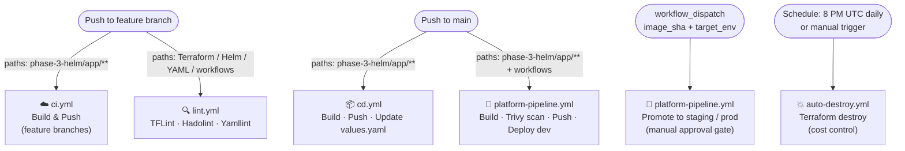

---

### 1 — `lint.yml` — Static analysis on every change

**Trigger:** push to `main` or any pull request touching Terraform, Helm charts, workflows, or YAML files.

```mermaid
flowchart LR
    push([Push / PR]) --> TF & HD & YL

    TF["tflint --recursive\nphase-1-terraform/\n\nChecks: unused vars,\nmissing required attrs,\nGoogle provider rules"]

    HD["hadolint\nbackend Dockerfile\nfrontend Dockerfile\n\nChecks: best practices,\nunpinned packages,\nmissing USER instruction"]

    YL["yamllint\n.github/workflows/\nphase-2-kubernetes/\nphase-5-gitops/\n\nChecks: indentation,\nline length, trailing\nspaces, blank lines"]

    TF --> pass(["✅ All jobs must pass\nbefore merging"])
    HD --> pass
    YL --> pass
```

**Config files:**
- `.tflint.hcl` — Google ruleset plugin, `call_module_type = none`
- `.hadolint.yaml` — ignores DL3005 and DL3008 (intentional patterns)
- `.yamllint.yml` — line length 150, allows `on:` as truthy, disables document-start

---

### 2 — `ci.yml` — Build and push on feature branches

**Trigger:** push to any branch except `main`, touching `phase-3-helm/app/**`.

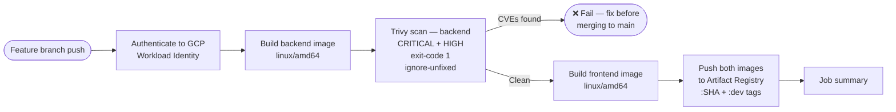

> **Note:** The scan happens after the push in `ci.yml` — images reach the registry even if the scan fails. The `platform-pipeline.yml` (which runs on main) scans before pushing and is the authoritative gate.

---

### 3 — `cd.yml` — Build, push, and update values on main

**Trigger:** push to `main` touching `phase-3-helm/app/**`.

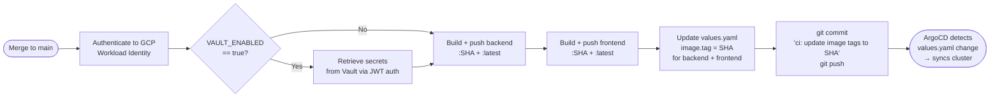

> `cd.yml` has no Trivy scan — it is the legacy pipeline from Phase 4/5. `platform-pipeline.yml` is the Phase 11 replacement with scan + multi-environment promotion. Both currently coexist; `cd.yml` will be deprecated once the Phase 11 pipeline is the primary delivery path.

---

### 4 — `platform-pipeline.yml` — The Phase 11 promotion pipeline

This is the primary pipeline introduced in the capstone. It covers the full path from code change to production with scan gates and approval controls.

**Trigger:**
- Push to `main` (or `feature/**`) touching `phase-3-helm/app/**` → runs CI + auto-deploys to dev
- `workflow_dispatch` with `image_sha` + `target_env` → promotes to staging or prod

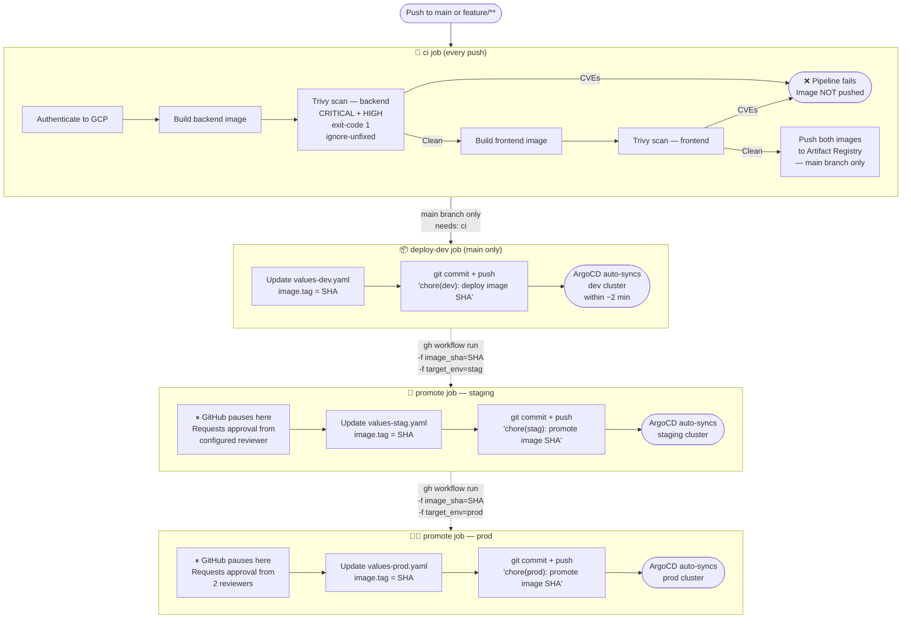

**Approval gates** (GitHub Environments):

| Environment | Required approvers | Branch restriction |
|---|---|---|
| `stag` | 1 (tech lead) | `main` only |
| `prod` | 2 (tech lead + CTO / SRE lead) | `main` only |

The `promote` job is gated by `environment: ${{ inputs.target_env }}`. GitHub pauses the job and sends review requests before executing any steps. The pipeline cannot proceed until the required approvers click **Approve** in the GitHub UI.

**How ArgoCD closes the loop:**

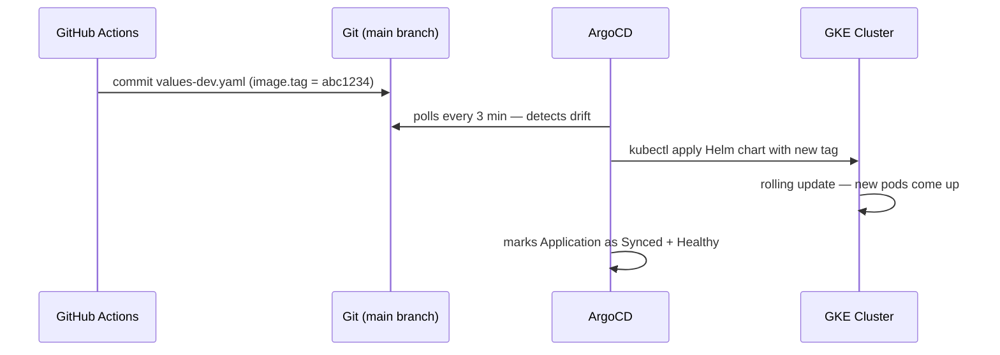

---

### 5 — `auto-destroy.yml` — Nightly cost control

**Trigger:** cron `0 20 * * *` (8 PM UTC daily) or manual `workflow_dispatch` with confirmation input.

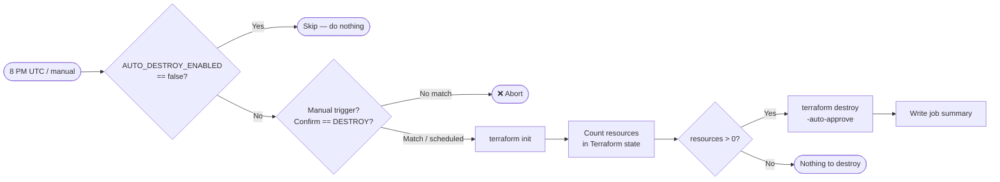

**Safety controls:**
- Set repository variable `AUTO_DESTROY_ENABLED = false` to pause nightly destruction (e.g. during a demo day)
- Manual runs require typing `DESTROY` in the confirmation input — prevents accidental triggers from the GitHub UI

---

### Pipeline interaction summary

```
Code change
    │
    ├─► lint.yml         — static analysis, blocks bad Terraform / Dockerfiles / YAML
    │
    ├─► ci.yml           — feature branch: build + Trivy gate (scan after push*)
    │
    └─► platform-pipeline.yml
            │
            ├─► ci job   — build + Trivy gate (scan before push ✓) + push on main
            │
            ├─► deploy-dev  — auto: updates values-dev.yaml → ArgoCD syncs dev
            │
            ├─► promote stag  — manual (1 approver): updates values-stag.yaml → ArgoCD syncs staging
            │
            └─► promote prod  — manual (2 approvers): updates values-prod.yaml → ArgoCD syncs prod

Nightly
    └─► auto-destroy.yml — terraform destroy to eliminate idle GCP costs
```

*`ci.yml` pushes before scanning — this is a known gap. `platform-pipeline.yml` is the authoritative delivery pipeline and scans before pushing.

---

## Troubleshooting

### ArgoCD ApplicationSet not generating Applications

Check the ApplicationSet controller logs:

```bash
kubectl logs -n argocd deploy/argocd-applicationset-controller | tail -50
```

The most common cause is the Git generator path not matching any directories. Verify the path pattern in the ApplicationSet against the actual directory structure:

```bash
ls phase-3-helm/charts/
```

If using the cluster generator, confirm the clusters are registered with the expected labels:

```bash
kubectl get secrets -n argocd -l argocd.argoproj.io/secret-type=cluster
```

If no secrets are listed, the clusters were not registered via `argocd cluster add`. Rerun the registration commands from Step 2.

### Terraform workspace state conflicts

If two workspaces share state, Terraform will report resource conflicts on apply. Confirm each workspace has its own state path:

```bash
gsutil ls gs://platform-eng-lab-will-tf-state/terraform/state/
```

You should see separate directories for `env:/dev`, `env:/staging`, and `env:/prod`. If they are missing, the workspace was never initialised. Run:

```bash
terraform -chdir=phase-1-terraform workspace select dev
terraform -chdir=phase-1-terraform init
```

### Backstage catalog not discovering services

The GitHub integration requires a token with `repo` and `read:org` scope. Verify the token is present and has the correct permissions:

```bash
kubectl get secret -n backstage backstage-github-token -o jsonpath='{.data.token}' | base64 -d | xargs -I{} \
  curl -s -H "Authorization: token {}" https://api.github.com/repos/wb-platform-engineering-lab/platform-engineering-lab-gke
```

If the response is `404 Not Found`, the token lacks repo access. Generate a new token and update the secret:

```bash
kubectl create secret generic backstage-github-token \
  --from-literal=token="<new-token>" \
  -n backstage \
  --dry-run=client -o yaml | kubectl apply -f -
kubectl rollout restart deploy/backstage -n backstage
```

Also confirm the `catalog-info.yaml` files exist at the paths referenced in the Backstage values:

```bash
ls phase-3-helm/app/backend/catalog-info.yaml
ls phase-3-helm/app/frontend/catalog-info.yaml
```

### NetworkPolicies blocking ArgoCD sync

ArgoCD syncs resources by reaching out to the API server and creating resources in destination namespaces. If a default-deny NetworkPolicy is applied to the `argocd` namespace, the ArgoCD application controller will lose connectivity.

Add an explicit allow rule for the ArgoCD namespace in your NetworkPolicy set. Add this to `phase-10-security/network-policies.yaml`:

```yaml
---
apiVersion: networking.k8s.io/v1
kind: NetworkPolicy
metadata:
  name: allow-argocd-egress
  namespace: argocd
spec:
  podSelector: {}
  policyTypes:
    - Egress
  egress:
    - {}  # Allow all egress from argocd namespace — ArgoCD needs to reach the API server and all cluster namespaces
```

Apply the fix and trigger a manual sync:

```bash
kubectl apply -f phase-10-security/network-policies.yaml
argocd app sync security-baseline-dev
```

### values-\<env\>.yaml missing causes ApplicationSet sync failure

The ApplicationSet template references `values-{{values.env}}.yaml`. If this file does not exist in the chart directory, Helm will fail with a `no such file` error. Ensure all three override files exist before the ApplicationSet is applied:

```bash
for env in dev staging prod; do
  for chart in backend frontend; do
    touch phase-3-helm/charts/${chart}/values-${env}.yaml
  done
done
```

Empty files are valid — Helm will use the base `values.yaml` for anything not overridden.

---

## Production Considerations

**GitOps for everything.** Every cluster state change goes through Git. No one runs `kubectl apply` by hand in staging or prod. If a fix is urgent enough to skip a PR, it is urgent enough to be reviewed within the hour and reverted if wrong. The audit trail is the PR history.

**Image immutability.** The promotion pipeline always references a 7-character SHA. The strings `:latest` and `:main` never appear in production `values.yaml` files. If a deployment is rolled back, the exact image that was running can be re-deployed by reverting the values commit in Git.

**Separate GCP projects per environment.** The lab uses separate clusters in the same project for cost reasons. In production, dev, staging, and prod should be in separate GCP projects. This provides blast-radius isolation (a misconfigured IAM policy in dev cannot affect prod), separate billing, and separate audit log streams that satisfy compliance requirements.

**Backstage as the single pane of glass.** Every service has a `catalog-info.yaml`. Every service links to its runbook, its Grafana dashboard, and its on-call rotation. When an incident starts, the on-call engineer opens the Backstage service page — not Slack, not a wiki, not a shared Google Doc that was last updated eight months ago.

**Progressive rollout to prod.** The promotion pipeline merges a values change to Git. ArgoCD applies it. All prod replicas update simultaneously via a rolling deployment. For a true production system, replace the rolling update in prod with an Argo Rollout (Phase 5b) configured with a canary strategy: 10% of traffic to the new version for 10 minutes, automated metric analysis against the SLO panel, then full promotion or automatic rollback.

**Vault for all secrets.** No environment-specific passwords, API keys, or tokens appear in `values-<env>.yaml` files. The Vault policies from Phase 7 are scoped per environment — a pod in staging cannot read a secret path that belongs to prod. Verify this after setting up each cluster:

```bash
vault policy read coverline-staging
vault policy read coverline-prod
```

**Regular DR drills.** The Terraform workspace approach means you can provision a fresh prod cluster from scratch with one command. Run a DR drill quarterly: spin up a new cluster, apply the ApplicationSet, restore the database from the latest snapshot, verify all services are healthy. Time it. The target for a platform this size is under 45 minutes to full operational status.

---

[📝 Take the Phase 11 quiz](https://wb-platform-engineering-lab.github.io/platform-engineering-lab-gke/phase-11-capstone/quiz.html)
