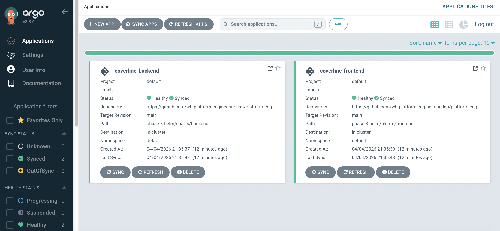
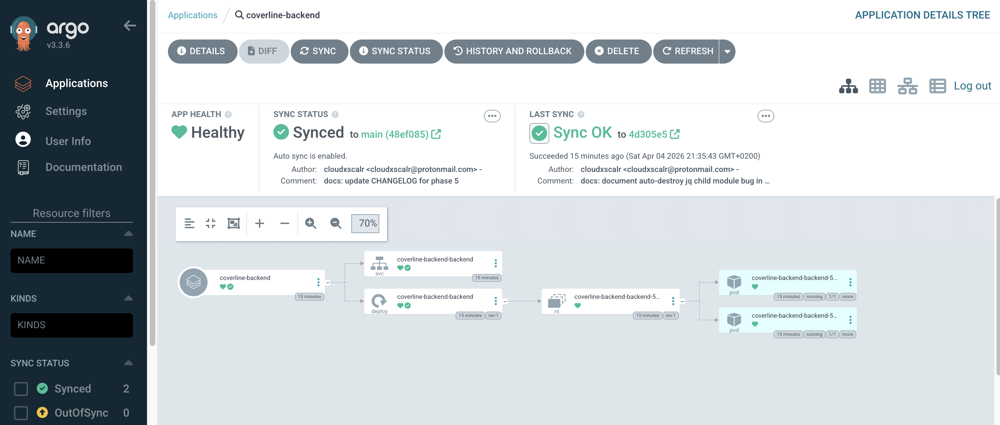
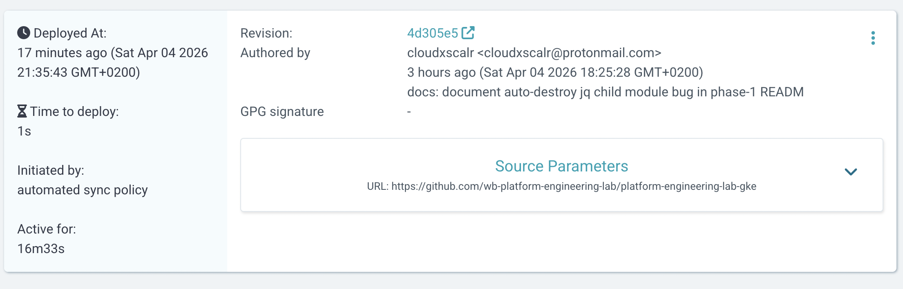

# Phase 5 — GitOps with ArgoCD

## What was built

- ArgoCD installed on GKE via the official manifests
- Two ArgoCD Applications watching the `main` branch of this repo:
  - `coverline-backend` → `phase-3-helm/charts/backend`
  - `coverline-frontend` → `phase-3-helm/charts/frontend`
- Automated sync with self-heal and prune enabled
- GitOps loop verified: change `values.yaml` → push to main → ArgoCD auto-syncs → cluster updated

## Screenshots

### Applications — Synced & Healthy


### Backend — Resource Graph


### Sync History


---

## GitOps Flow

```
Developer pushes to main
    └── ArgoCD polls repo every 3 minutes
            └── Detects diff between repo and cluster state
                    └── Auto-syncs — applies Helm chart changes
                            └── Cluster matches repo state
```

## Install ArgoCD

```bash
kubectl create namespace argocd
kubectl apply -n argocd -f https://raw.githubusercontent.com/argoproj/argo-cd/stable/manifests/install.yaml
kubectl get pods -n argocd -w
```

## Access the UI

```bash
# Get admin password
kubectl -n argocd get secret argocd-initial-admin-secret -o jsonpath="{.data.password}" | base64 -d && echo

# Port-forward
kubectl port-forward svc/argocd-server -n argocd 8080:443
```

Open `https://localhost:8080` — login: `admin` / password from above.

## Deploy ArgoCD Applications

```bash
kubectl apply -f phase-5-gitops/argocd-app-backend.yaml
kubectl apply -f phase-5-gitops/argocd-app-frontend.yaml
kubectl get applications -n argocd
```

## Verify GitOps loop

```bash
# Change a value in git and push to main
# Example: scale backend to 3 replicas
vim phase-3-helm/charts/backend/values.yaml  # replicaCount: 3
git add . && git commit -m "scale backend to 3" && git push origin main

# Watch ArgoCD sync automatically (within 3 minutes)
kubectl get pods -w
kubectl get applications -n argocd -w
```

## Teardown

```bash
kubectl delete -f phase-5-gitops/
kubectl delete namespace argocd
```

---

## Troubleshooting

### 1. Application stuck in `Progressing`

**Cause:** Backend pods can't start without PostgreSQL and Redis.

**Fix:** Deploy the dependencies first:
```bash
helm install postgresql bitnami/postgresql \
  --set auth.username=coverline \
  --set auth.password=coverline123 \
  --set auth.database=coverline \
  --set primary.persistence.size=1Gi

helm install redis bitnami/redis \
  --set auth.enabled=false \
  --set master.persistence.size=1Gi
```

### 2. ArgoCD not detecting changes

**Cause:** ArgoCD polls every 3 minutes by default.

**Fix:** Force an immediate sync from the UI or CLI:
```bash
kubectl -n argocd exec -it deploy/argocd-server -- argocd app sync coverline-backend
```

---

## Production Considerations

### 1. Adopt the App of Apps pattern
In this lab, each ArgoCD Application is declared in a separate YAML file applied manually. In production with many services, the "App of Apps" pattern allows a parent ArgoCD Application to manage all others — a single entry point for the entire cluster, versioned in Git.

```yaml
# app-of-apps.yaml — manages all apps from a single place
spec:
  source:
    path: apps/          # contains backend.yaml, frontend.yaml, monitoring.yaml...
```

### 2. Configure ArgoCD notifications
This lab notifies nobody on sync failure or drift. In production, ArgoCD Notifications sends alerts to Slack, PagerDuty, or Teams as soon as an application is OutOfSync or Degraded — before users notice the problem.

### 3. Use GitHub webhooks instead of polling
ArgoCD polls the repo every 3 minutes by default. In production, configuring a GitHub webhook that notifies ArgoCD immediately on every push reduces sync delay from 3 minutes to a few seconds — critical for frequent deployments.

### 4. Manage multiple clusters with ArgoCD
This lab uses ArgoCD to deploy to a single cluster. In production, a centralised ArgoCD instance (hub-and-spoke) can manage dozens of clusters (dev, staging, prod, multi-region) from a single control point with RBAC policies per team.

### 5. Separate the application repo from the config repo
In this lab, source code and Helm values live in the same repo. In production, config changes (updating an env var, scaling a service) should not trigger an image rebuild. Separating the two repos allows deploying a new config without recompiling the code.

### 6. Scope `selfHeal` in production with sync windows
`selfHeal: true` automatically corrects any drift — which is powerful but can be dangerous if an operator makes an emergency change directly in production. ArgoCD Sync Windows allow disabling auto-sync during low-traffic hours or maintenance windows.
