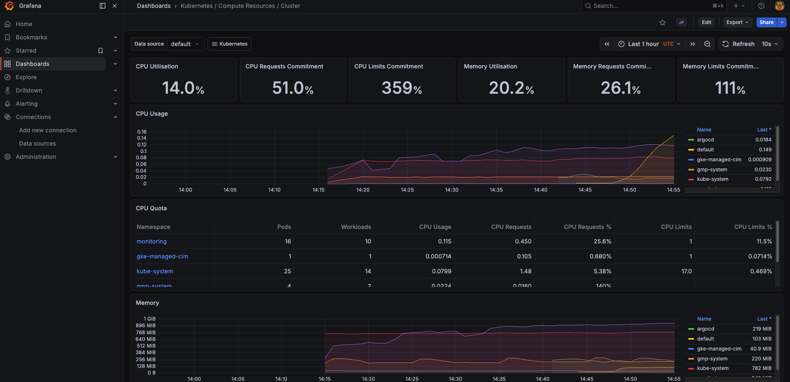
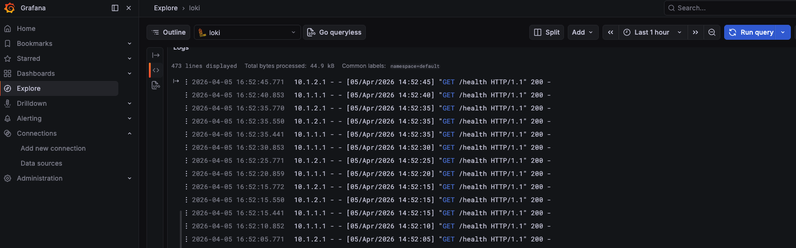
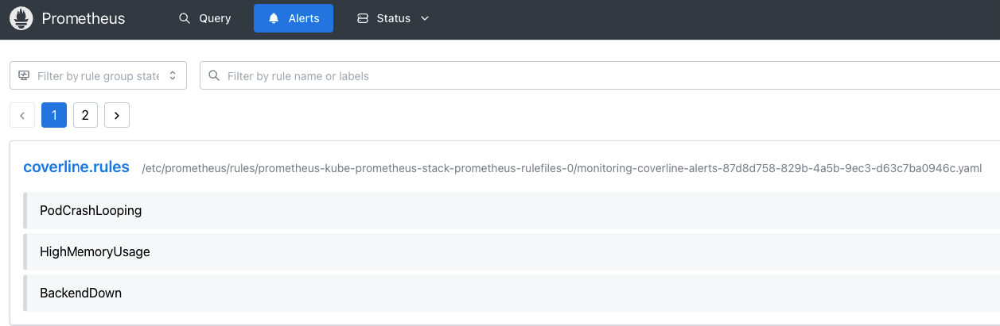

# Phase 6 — Observability Stack

---

> **CoverLine — 50,000 members. November.**
>
> At 2:14 AM on a Tuesday, CoverLine's claims processing stopped working. Members trying to submit claims got a blank screen. The backend was returning timeouts.
>
> The on-call engineer woke up at 6:30 AM — not to a page, but to a Slack message from a member who had emailed support. By then, the issue had been ongoing for four hours and had self-resolved. No one knew what had caused it. No one knew how many members were affected. The engineering team spent a full day trying to piece together what had happened from application logs scattered across three pods.
>
> The post-mortem conclusion was brutal: *"We found out about a 4-hour outage from a customer. We had no metrics, no alerts, and no centralised logs. We were flying blind."*
>
> The decision: a full observability stack. Prometheus for metrics, Grafana for dashboards, Loki for logs. If it happens again, the team wakes up before the customer does.

> **▶ [Watch the incident unfold →](https://wb-platform-engineering-lab.github.io/platform-engineering-lab-gke/phase-6-observability/incident-animation.html)**
> *(animated — 4-hour silent outage vs 9-minute paged response)*

---

## What was built

- Prometheus + Alertmanager via kube-prometheus-stack
- Grafana with pre-installed Kubernetes dashboards
- Loki for log aggregation
- Promtail as log collector (DaemonSet — one pod per node)
- 3 PrometheusRule alerts for CoverLine (CrashLooping, HighMemory, BackendDown)

## Screenshots

### Grafana — Kubernetes Dashboards


### Grafana — CoverLine Logs (Loki)


### Prometheus — Alerts


---

## Prerequisites

Phase 6 requires the CoverLine apps to be running in the cluster.
On a fresh cluster, redeploy ArgoCD and let it sync the apps automatically:

```bash
# Install ArgoCD
kubectl create namespace argocd
kubectl apply -n argocd -f https://raw.githubusercontent.com/argoproj/argo-cd/stable/manifests/install.yaml
kubectl get pods -n argocd -w

# Deploy CoverLine applications
kubectl apply -f phase-5-gitops/argocd-app-backend.yaml
kubectl apply -f phase-5-gitops/argocd-app-frontend.yaml
kubectl get applications -n argocd
```

Also install PostgreSQL and Redis dependencies if not already present:

```bash
helm install postgresql bitnami/postgresql \
  --set auth.username=coverline \
  --set auth.password=coverline123 \
  --set auth.database=coverline \
  --set primary.persistence.size=1Gi

helm install redis bitnami/redis \
  --set auth.enabled=false \
  --set master.persistence.size=1Gi
```

---

## Install the Observability Stack

```bash
# Add Helm repos
helm repo add prometheus-community https://prometheus-community.github.io/helm-charts
helm repo add grafana https://grafana.github.io/helm-charts
helm repo update

# Create namespace
kubectl create namespace monitoring

# Install Prometheus + Grafana + Alertmanager
helm install kube-prometheus-stack prometheus-community/kube-prometheus-stack \
  --namespace monitoring \
  -f phase-6-observability/kube-prometheus-stack-values.yaml

# Install Loki
helm install loki grafana/loki \
  --namespace monitoring \
  -f phase-6-observability/loki-values.yaml

# Install Promtail
helm install promtail grafana/promtail \
  --namespace monitoring \
  -f phase-6-observability/promtail-values.yaml
```

---

## Access the UIs

### Grafana

```bash
kubectl port-forward -n monitoring svc/kube-prometheus-stack-grafana 3000:80
```

Open `http://localhost:3000` — login: `admin` / get password with:
```bash
kubectl get secret kube-prometheus-stack-grafana -n monitoring \
  -o jsonpath="{.data.admin-password}" | base64 -d
```

### Prometheus

```bash
kubectl port-forward -n monitoring svc/kube-prometheus-stack-prometheus 9090:9090
```

Open `http://localhost:9090`

### ArgoCD

```bash
# Get admin password
kubectl -n argocd get secret argocd-initial-admin-secret -o jsonpath="{.data.password}" | base64 -d && echo

# Port-forward
kubectl port-forward svc/argocd-server -n argocd 8080:443
```

Open `https://localhost:8080` — login: `admin` / password from above.

---

## Connect Loki to Grafana

1. Open Grafana → **Connections → Data sources → Add data source**
2. Select **Loki** (Core plugin)
3. URL: `http://loki.monitoring.svc.cluster.local:3100`
4. Click **Save & test**

> **Note:** Use port 3100 on the `loki` service directly, not the gateway. The gateway (port 80) may require auth headers depending on your Loki configuration.

---

## Production Diagnostic Queries (LogQL — Loki)

These are the queries you reach for first when something breaks in production.
Run them in **Grafana → Explore → Loki**.

---

### 1. All errors in a namespace — immediate overview

```logql
{namespace="default"} |= "error" or "ERROR" or "Error"
```

**When to use:** First query during an incident — identify which pod is generating errors before going further.

---

### 2. Logs from a specific pod — zoom in on the CoverLine backend

```logql
{namespace="default", app="backend"} != "GET /health"
```

**When to use:** The backend is generating errors — filter out noisy health check traffic and see only meaningful log lines. Promtail attaches `app="backend"` (not `app_kubernetes_io_name`) based on the pod label.

---

### 3. HTTP 5xx errors — API incidents in production

```logql
{namespace="default"} | json | status >= 500
```

**When to use:** Error rate is rising on your dashboard — see exactly which requests are failing and with what message.

---

### 4. Error rate per pod over the last 5 minutes — which pod is unhealthy?

```logql
sum by (pod) (
  rate({namespace="default"} |= "error" [5m])
)
```

**When to use:** Multiple pods are running — find out which one is generating the most errors without reading logs one by one.

---

### 5. Crash / OOMKill logs — pod killed due to memory pressure

```logql
{namespace="default"} |= "OOMKilled" or "out of memory" or "killed"
```

**When to use:** A pod is restarting in a loop — confirm it's a memory issue before adjusting resource `limits`.

---

### 6. Logs from the 15 minutes before an incident — post-mortem timeline

```logql
{namespace="default", app="coverline-backend"}
  | json
  | line_format "{{.time}} [{{.level}}] {{.message}}"
```

Set the time range to the incident window in Grafana.

**When to use:** Post-mortem — reconstruct the exact sequence of events leading to the incident.

---

### 7. Slow PostgreSQL queries — slow queries detected in logs

```logql
{namespace="default", app="postgresql"} |= "duration"
  | regexp `duration: (?P<duration_ms>\d+\.\d+) ms`
  | duration_ms > 500
```

**When to use:** The backend is slow — check whether the DB is the bottleneck slowing down `/claims` calls.

---

### 8. Redis connection errors — cache unavailable

```logql
{namespace="default"} |= "redis" |= "connection refused" or "timeout" or "ECONNREFUSED"
```

**When to use:** Redis is down — `/claims` requests are hitting PostgreSQL directly and response times are spiking.

---

### 9. Kubernetes system logs — cluster events (evictions, scheduling failures)

```logql
{namespace="kube-system"} |= "Evicted" or "FailedScheduling" or "OOMKilling"
```

**When to use:** Pods are disappearing without obvious cause — check whether the scheduler or kubelet evicted them.

---

### 10. Log volume per pod — which service is the most verbose?

```logql
sum by (pod) (
  count_over_time({namespace="default"}[1h])
)
```

**When to use:** Loki storage costs are increasing — identify which service is over-logging and tune its log level (`INFO` → `WARNING`).

---

## LogQL Top 10 Cheat Sheet

Quick-reference for the most useful queries during an incident. Run in **Grafana → Explore → Loki**.

| # | What | Query |
|---|------|-------|
| 1 | All errors in namespace | `{namespace="default"} \|= "ERROR"` |
| 2 | Backend logs, no health noise | `{namespace="default", app="backend"} != "GET /health"` |
| 3 | Error rate per pod (graph) | `sum by (pod) (rate({namespace="default"} \|= "ERROR" [5m]))` |
| 4 | Log volume per pod | `sum by (pod) (count_over_time({namespace="default"}[5m]))` |
| 5 | HTTP 5xx errors | `{namespace="default"} \| json \| status >= 500` |
| 6 | OOMKill / memory pressure | `{namespace="default"} \|= "OOMKilled"` |
| 7 | Slow PostgreSQL queries >500ms | `{namespace="default", app="postgresql"} \|= "duration" \| regexp \`duration: (?P<ms>\d+\.\d+) ms\` \| ms > 500` |
| 8 | Redis connection errors | `{namespace="default"} \|= "redis" \|= "connection refused"` |
| 9 | Scheduling / eviction events | `{namespace="kube-system"} \|= "FailedScheduling"` |
| 10 | Logs in a time window (post-mortem) | Set time range in Grafana + `{namespace="default", app="backend"}` |

> **Tip:** In Grafana Explore, set the time range to the incident window before running query 10 — this is the first thing to do in a post-mortem to reconstruct the timeline.

---

## Troubleshooting

### loki-chunks-cache-0 stuck in Pending

**Cause:** Insufficient memory on nodes (e2-standard-2 with 8GB RAM fills up quickly).

**Fix:** Disable caches in `loki-values.yaml` — already configured:
```yaml
chunksCache:
  enabled: false
resultsCache:
  enabled: false
```

### No logs in namespace `default`

**Cause:** CoverLine apps are not deployed on the fresh cluster.

**Fix:** Redeploy via ArgoCD (see Prerequisites above).

---

## Production Considerations

### 1. Store Prometheus metrics long-term with Thanos or GCS
In this lab, Prometheus retains 7 days of metrics in local memory/disk. In production, historical data is essential for trend analysis, capacity planning, and audit responses. Thanos or Grafana Mimir allow storing years of metrics on GCS at low cost.

### 2. Configure Alertmanager to route to PagerDuty or Slack
This lab creates alert rules but Alertmanager is not configured to notify anyone. In production, critical alerts (BackendDown, PodCrashLooping) should trigger a PagerDuty page with escalation, while warnings (HighMemoryUsage) can go to a Slack channel.

```yaml
# alertmanager config
route:
  receiver: slack-warnings
  routes:
    - match:
        severity: critical
      receiver: pagerduty-oncall
```

### 3. Define SLOs and error budgets
This lab measures raw metrics (CPU, memory, restarts). In production, the team should define SLOs (e.g.: 99.9% of `/claims` requests respond in under 500ms) and calculate the error budget burn rate. Grafana SLO or sloth can automatically generate the corresponding PromQL rules.

### 4. Enable Loki log retention on GCS
This lab uses local filesystem for Loki — logs disappear if the pod restarts. In production, Loki should store chunks on GCS with a retention policy per namespace (e.g.: 30 days for application logs, 90 days for security audit logs).

### 5. Isolate the monitoring namespace with NetworkPolicies
In this lab, Prometheus can scrape any pod in the cluster. In production, NetworkPolicies should restrict access: only Prometheus can contact service `/metrics` endpoints, and only Grafana can query Prometheus. This prevents a compromised pod from exfiltrating sensitive metrics.

### 6. Never expose Grafana without strong authentication
This lab accesses Grafana via port-forward with a generated password. In production, Grafana should be exposed via an Ingress with TLS and SSO authentication (Google OAuth, Okta) — never with a shared password. Dashboards containing business metrics (claims rate, revenue) are sensitive data.

### 7. Instrument the application with prometheus-flask-exporter
This lab measures infrastructure metrics only (CPU, memory, restarts). In production, instrument the Flask backend to expose HTTP-level metrics — request rate, latency, and error rate per endpoint:

```python
# requirements.txt
prometheus-flask-exporter

# app.py
from prometheus_flask_exporter import PrometheusMetrics
metrics = PrometheusMetrics(app)
```

This unlocks PromQL queries like:
```promql
# p99 latency per endpoint
histogram_quantile(0.99,
  sum(rate(flask_http_request_duration_seconds_bucket[5m])) by (le, endpoint)
)

# Error rate per endpoint
sum(rate(flask_http_request_total{status=~"5.."}[5m])) by (endpoint)
/
sum(rate(flask_http_request_total[5m])) by (endpoint)
```

### 8. Use recording rules for expensive PromQL queries
Queries that aggregate across many pods run on every dashboard refresh and can overload Prometheus. Pre-compute them with recording rules:

```yaml
- record: job:flask_http_requests_total:rate5m
  expr: sum(rate(flask_http_request_total[5m])) by (job, status)
```

Dashboard panels then query the pre-computed metric instead of re-aggregating on every load.

### 9. Set up Loki log-based alerting (Loki Ruler)
This lab alerts on Prometheus metrics only. In production, configure Loki's Ruler to fire alerts directly from log patterns — useful for errors that don't surface as metrics:

```yaml
groups:
  - name: coverline-log-alerts
    rules:
      - alert: BackendDBError
        expr: |
          sum(count_over_time({app="backend"} |= "DB init failed" [5m])) > 0
        for: 1m
        labels:
          severity: critical
        annotations:
          summary: "Backend cannot reach the database"
```

### 10. Set resource limits on the monitoring stack itself
Prometheus and Loki can consume significant memory in production. Set explicit resource requests and limits in the Helm values — without them, a metrics cardinality explosion (too many unique label combinations) can OOMKill Prometheus and take down your observability stack at the worst possible moment.

---

## What's Next — Phase 12: AI-Powered SRE Agent

Phase 6 gives you the raw observability data. Phase 12 will go further by building an **AI SRE agent** that queries this stack automatically and generates natural-language diagnoses.

### Planned capabilities

| Capability | Implementation |
|---|---|
| Automated log analysis | Agent queries Loki HTTP API → feeds output to Claude/Gemini |
| Anomaly detection | Prometheus metrics → LLM root-cause analysis |
| Incident summary | Correlates logs + metrics + alerts into a single narrative |
| Remediation suggestions | Suggests kubectl commands or config changes |

### GCP native equivalent

Google's **Gemini Cloud Assist** offers similar functionality for GCP-native stacks (Cloud Logging, Cloud Monitoring). The Phase 12 agent will be **portable** — it works with any Loki + Prometheus stack regardless of cloud provider, which is more relevant for a multi-cloud production environment.

### Preview — what the agent will do

```
Incident detected: BackendDown alert firing for 5 minutes

Agent queries:
  1. Loki: {app="coverline-backend"} | json — last 15 minutes
  2. Prometheus: container_memory_working_set_bytes{pod=~"coverline-backend.*"}
  3. Kubernetes events: kubectl get events --field-selector reason=BackendOff

LLM analysis:
  Root cause: OOMKilled — backend pod exceeded memory limit (256Mi)
  Evidence: 3 OOMKilled events, memory at 98% for 8 minutes before crash
  Suggested fix: Increase memory limit to 512Mi in values.yaml
```

> The LogQL queries in this README are the exact queries the Phase 12 agent will run automatically.


---

[📝 Take the Phase 6 quiz](https://wb-platform-engineering-lab.github.io/platform-engineering-lab-gke/phase-6-observability/quiz.html)
