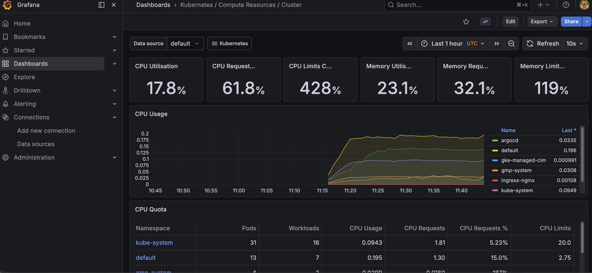
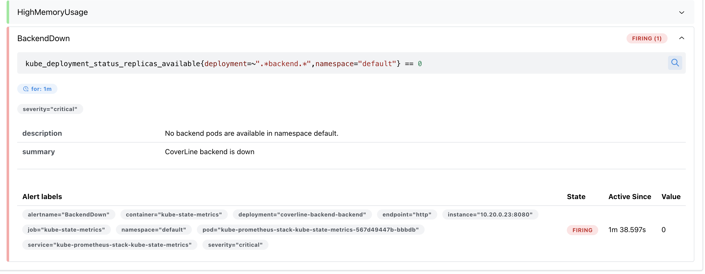
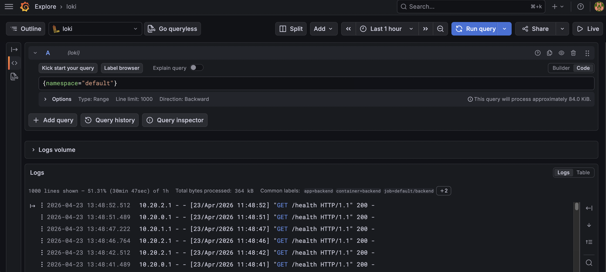

# Phase 6 — Observability Stack

> **Observability concepts introduced:** Prometheus, Grafana, Loki, Promtail, PrometheusRule, LogQL | **Builds on:** Phase 5 GitOps cluster

[▶ Watch the incident animation](https://wb-platform-engineering-lab.github.io/platform-engineering-lab-gke/phase-6-observability/incident-animation.html) · [📝 Take the quiz](https://wb-platform-engineering-lab.github.io/platform-engineering-lab-gke/phase-6-observability/quiz.html)

---

## Concepts introduced

| Concept | What it does | Why we need it |
|---|---|---|
| **Prometheus** | Scrapes and stores time-series metrics from pods and nodes | Source of truth for cluster and application health — powers alerts and dashboards |
| **Alertmanager** | Routes Prometheus alerts to notification channels | Pages on-call before users notice a problem |
| **Grafana** | Visualises metrics (Prometheus) and logs (Loki) in dashboards | Single pane of glass — operators see the cluster without running kubectl |
| **Loki** | Aggregates logs from all pods into a queryable store | Centralised logs across all pods — no more `kubectl logs pod-xxxx` during an incident |
| **Promtail** | DaemonSet that ships pod logs to Loki | One collector per node, zero app instrumentation required |
| **PrometheusRule** | CRD that defines alert conditions in PromQL | Alert rules versioned in Git, applied automatically by the Prometheus operator |

---

## The problem

> *CoverLine — 50,000 members. November.*
>
> At 2:14 AM on a Tuesday, CoverLine's claims processing stopped working. Members trying to submit claims got a blank screen. The backend was returning timeouts.
>
> The on-call engineer woke up at 6:30 AM — not to a page, but to a Slack message from a member who had emailed support. By then, the issue had been ongoing for four hours and had self-resolved. No one knew what caused it. No one knew how many members were affected. The engineering team spent a full day piecing together what had happened from logs scattered across three pods.
>
> *"We found out about a 4-hour outage from a customer. We had no metrics, no alerts, and no centralised logs. We were flying blind."*

The decision: a full observability stack. Prometheus for metrics, Grafana for dashboards, Loki for logs. If it happens again, the team wakes up before the customer does.

---

## Architecture

```
Cluster nodes + pods
    │
    ├── Prometheus (kube-prometheus-stack)
    │       ├── Scrapes /metrics from all pods every 15s
    │       ├── Scrapes node-exporter (CPU, memory, disk per node)
    │       ├── kube-state-metrics (Deployment replicas, pod status)
    │       └── Evaluates PrometheusRules → fires alerts to Alertmanager
    │
    ├── Promtail (DaemonSet — 1 pod per node)
    │       └── Tails pod log files → ships to Loki
    │
    ├── Loki
    │       └── Stores logs indexed by labels (namespace, pod, app)
    │
    └── Grafana
            ├── Dashboards: Kubernetes cluster, node metrics, pod resources
            ├── Explore: ad-hoc Prometheus (PromQL) and Loki (LogQL) queries
            └── Alerts: PrometheusRule alerts visible in Alertmanager UI

PrometheusRules (coverline-alerts):
  PodCrashLooping  — restart rate > 0 for 5m         severity: critical
  HighMemoryUsage  — memory > 80% of limit for 5m    severity: warning
  BackendDown      — 0 available backend replicas     severity: critical
```

---

## Repository structure

```
phase-6-observability/
├── kube-prometheus-stack-values.yaml  ← Prometheus + Grafana + Alertmanager config
├── loki-values.yaml                   ← Loki config (caches disabled for e2-standard-2)
├── promtail-values.yaml               ← Promtail log shipping config
└── coverline-alerts.yaml              ← PrometheusRule: CrashLooping, HighMemory, BackendDown
```

---

## Prerequisites

CoverLine apps running in the cluster (ArgoCD synced from Phase 5):

```bash
kubectl get applications -n argocd
kubectl get pods -l app.kubernetes.io/name=backend
```

Add Helm repositories:

```bash
helm repo add prometheus-community https://prometheus-community.github.io/helm-charts
helm repo add grafana https://grafana.github.io/helm-charts
helm repo update
```

---

## Architecture Decision Records

- `docs/decisions/adr-024-kube-prometheus-stack.md` — Why kube-prometheus-stack over standalone Prometheus for a full monitoring bundle
- `docs/decisions/adr-025-loki-over-elasticsearch.md` — Why Loki over Elasticsearch/OpenSearch for log aggregation on a cost-constrained cluster
- `docs/decisions/adr-026-promtail-daemonset.md` — Why Promtail over Fluentd or Fluent Bit as the log collector

---

## Challenge 1 — Deploy the Prometheus stack

### Step 1: Create the monitoring namespace

```bash
kubectl create namespace monitoring
```

### Step 2: Install kube-prometheus-stack

```bash
helm install kube-prometheus-stack prometheus-community/kube-prometheus-stack \
  --namespace monitoring \
  -f phase-6-observability/kube-prometheus-stack-values.yaml
```

This installs Prometheus, Alertmanager, Grafana, node-exporter (DaemonSet), and kube-state-metrics in a single chart.

### Step 3: Verify all pods are running

```bash
kubectl get pods -n monitoring -w
```

Expected — all pods `Running`:
```
kube-prometheus-stack-grafana-xxxx               3/3   Running
kube-prometheus-stack-prometheus-0               2/2   Running
kube-prometheus-stack-alertmanager-0             2/2   Running
kube-prometheus-stack-kube-state-metrics-xxxx    1/1   Running
kube-prometheus-stack-prometheus-node-exporter-x 1/1   Running
```

---

## Challenge 2 — Deploy Loki and Promtail

### Step 1: Install Loki

```bash
helm install loki grafana/loki \
  --namespace monitoring \
  -f phase-6-observability/loki-values.yaml
```

> The values file disables `chunksCache` and `resultsCache` — both require significant memory that exceeds the `e2-standard-2` node limit.

### Step 2: Install Promtail

```bash
helm install promtail grafana/promtail \
  --namespace monitoring \
  -f phase-6-observability/promtail-values.yaml
```

Promtail runs as a DaemonSet — one pod per node. It tails the log files written by the container runtime and ships them to Loki, labelled by namespace, pod name, and container.

### Step 3: Verify Promtail is collecting logs

```bash
kubectl get pods -n monitoring -l app.kubernetes.io/name=promtail
kubectl logs -n monitoring -l app.kubernetes.io/name=promtail | grep "Sending batch"
```

---

## Challenge 3 — Access Grafana and connect Loki

### Step 1: Port-forward Grafana

```bash
kubectl port-forward -n monitoring svc/kube-prometheus-stack-grafana 3000:80
```

### Step 2: Get the admin password

```bash
kubectl get secret kube-prometheus-stack-grafana -n monitoring \
  -o jsonpath="{.data.admin-password}" | base64 -d && echo
```

Open `http://localhost:3000` — login: `admin` / password from above.

### Step 3: Add Loki as a data source

1. **Connections → Data sources → Add data source**
2. Select **Loki**
3. URL: `http://loki.monitoring.svc.cluster.local:3100`
4. Click **Save & test**

Expected: `Data source connected and labels found.`

### Step 4: Explore the pre-installed Kubernetes dashboards

Navigate to **Dashboards**. The kube-prometheus-stack installs several dashboards automatically:

- **Kubernetes / Compute Resources / Cluster** — overall CPU and memory
- **Kubernetes / Compute Resources / Namespace (Pods)** — per-pod resource usage
- **Node Exporter / Nodes** — disk, network, and system metrics per node



---

## Challenge 4 — Apply the CoverLine alert rules

### Step 1: Review `coverline-alerts.yaml`

```yaml
rules:
  - alert: PodCrashLooping
    expr: rate(kube_pod_container_status_restarts_total{namespace="default"}[5m]) * 60 > 0
    for: 5m
    labels:
      severity: critical

  - alert: HighMemoryUsage
    expr: |
      (container_memory_working_set_bytes{namespace="default", container!=""} /
       container_spec_memory_limit_bytes{namespace="default", container!=""}) > 0.8
    for: 5m
    labels:
      severity: warning

  - alert: BackendDown
    expr: kube_deployment_status_replicas_available{namespace="default", deployment=~".*backend.*"} == 0
    for: 1m
    labels:
      severity: critical
```

### Step 2: Apply the PrometheusRule

```bash
kubectl apply -f phase-6-observability/coverline-alerts.yaml
```

### Step 3: Verify Prometheus has picked up the rules

```bash
kubectl port-forward -n monitoring svc/kube-prometheus-stack-prometheus 9090:9090
```

Open `http://localhost:9090` → **Alerts**. The three CoverLine rules should appear with status `Inactive`.

### Step 4: Trigger the BackendDown alert

```bash
kubectl scale deployment coverline-backend --replicas=0
```

Wait 1 minute, then check `http://localhost:9090/alerts` — `BackendDown` should transition to `Pending` then `Firing`. 



Restore:

```bash
kubectl scale deployment coverline-backend --replicas=2
```

---

## Challenge 5 — Query logs with LogQL

Run these queries in **Grafana → Explore → Loki** during normal operation and during the `BackendDown` test.

### Immediate incident overview — all errors in the default namespace

```logql
{namespace="default"} |= "error" or |= "ERROR"
```



### Backend logs — filter out health check noise

```logql
{namespace="default", app="backend"} != "GET /health"
```

### Error rate per pod (graph view)

```logql
sum by (pod) (
  rate({namespace="default"} |= "ERROR" [5m])
)
```

Switch to **Time series** in the visualisation selector to see error rate over time per pod.

### HTTP 5xx errors

```logql
{namespace="default"} | json | status >= 500
```

### Post-mortem — reconstruct a timeline

Set the Grafana time range to the incident window, then run:

```logql
{namespace="default", app="backend"}
  | json
  | line_format "{{.time}} [{{.level}}] {{.message}}"
```

This shows the exact sequence of log lines during the incident — the same query the Phase 6 team would have used if they'd had Loki at 2:14 AM.

---

## Teardown

```bash
helm uninstall kube-prometheus-stack loki promtail -n monitoring
kubectl delete namespace monitoring
kubectl delete -f phase-6-observability/coverline-alerts.yaml
```

---

## Cost breakdown

The observability stack runs as pods on the existing GKE cluster. No additional GCP resources are created.

| Resource | $/day |
|---|---|
| GKE cluster (Phase 1) | ~$0.66 |
| Prometheus + Grafana + Loki pods | included in node cost |
| **Phase 6 additional cost** | **$0** |

> On an `e2-standard-2` node (8GB RAM), the full observability stack with CoverLine apps consumes roughly 5–6GB. Consider enabling cluster autoscaling if pods are evicted due to memory pressure.

---

## Observability concept: the three pillars

Observability is built on three complementary signals:

**Metrics (Prometheus)** — numeric measurements sampled over time. Answer questions like *"how many requests per second?"* and *"what is the p99 latency?"*. Cheap to store, fast to query, ideal for dashboards and alerts.

**Logs (Loki)** — structured or unstructured text emitted by the application. Answer questions like *"what exactly happened in pod X at 2:17 AM?"*. Expensive to store at scale, but irreplaceable for debugging individual incidents.

**Traces** — not covered in this phase. Distributed traces record the path of a single request across multiple services. Essential for diagnosing latency in multi-service architectures.

The four-hour silent outage in this phase's incident narrative could not have happened with all three pillars in place:
- Metrics would have triggered a `BackendDown` alert within 1 minute
- Logs would have shown the exact error message causing the timeout
- Alertmanager would have paged on-call at 2:15 AM instead of 6:30 AM

---

## Production considerations

### 1. Store metrics long-term with Thanos or Grafana Mimir
Prometheus retains data locally — losing the pod loses the history. In production, use Thanos or Grafana Mimir to shard and store metrics on GCS. Years of data at low cost, queryable across multiple clusters.

### 2. Configure Alertmanager routing
This lab creates alert rules but Alertmanager sends notifications nowhere. In production, route `critical` alerts to PagerDuty with escalation and `warning` alerts to a Slack channel:

```yaml
route:
  receiver: slack-warnings
  routes:
    - match:
        severity: critical
      receiver: pagerduty-oncall
```

### 3. Define SLOs and error budgets
Raw metrics (CPU, restarts) are necessary but not sufficient. Define SLOs — *"99.9% of `/claims` requests respond in under 500ms"* — and track the error budget burn rate. Grafana SLO or sloth auto-generate the corresponding PromQL rules.

### 4. Instrument the application
This lab measures infrastructure metrics only. In production, add `prometheus-flask-exporter` to the backend to expose HTTP request rate, latency, and error rate per endpoint — the metrics the Phase 5b AnalysisTemplate needs for a proper HTTP-level canary gate.

### 5. Store Loki logs on GCS with retention policies
This lab uses local filesystem storage — logs disappear on pod restart. In production, configure Loki to store chunks on GCS with retention policies per namespace: 30 days for application logs, 90 days for security audit logs.

### 6. Isolate the monitoring namespace with NetworkPolicies
Prometheus can scrape any pod in the cluster by default. In production, NetworkPolicies should restrict access: only Prometheus reaches `/metrics` endpoints, only Grafana queries Prometheus. A compromised pod cannot enumerate cluster metrics.

### 7. Never expose Grafana without authentication
This lab accesses Grafana via port-forward. In production, expose Grafana through an Ingress with TLS and SSO (Google OAuth, Okta). Dashboards showing claims rates and member counts are business-sensitive data.

---

## Outcome

The cluster is no longer opaque. Every pod's CPU, memory, and restart count is visible in Grafana. All pod logs flow to Loki and are queryable by namespace, pod, and content. Three alert rules fire within minutes of a CoverLine incident — before members notice. The on-call engineer wakes up to a page, not a support email.

---

[Back to main README](../README.md) | [Next: Phase 7 — Vault](../phase-7-vault/README.md)
